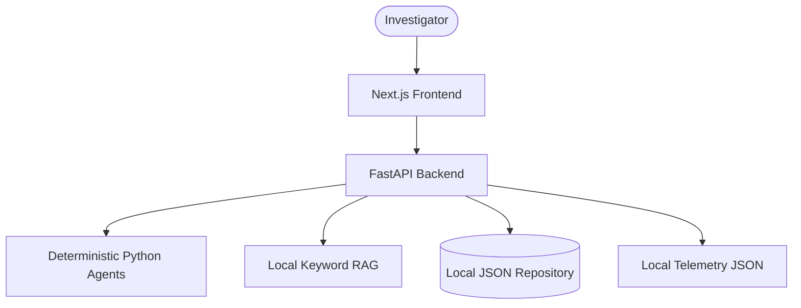

# Architecture

This document describes the high-level architecture of the Agentic AI Fraud Investigation Azure platform, detailing both the local MVP view and the target Azure production view.

## System Context

The system assists fraud investigators by automatically analyzing cases using AI, retrieving relevant policy information via RAG, and preparing summaries and recommendations. A core safety tenet is that the AI does not autonomously take punitive actions (e.g., freezing accounts). Instead, a human-in-the-loop (HitL) mechanism ensures investigators review the evidence and approve or override the AI's recommendations.

## Target Azure Architecture

```mermaid
graph TD
    User([Investigator]) --> App[Azure Container Apps (Frontend)]
    App --> API[Azure Container Apps (Backend)]
    
    API --> Agent[Agentic Engine]
    API --> RAG[RAG Service]
    API --> DB[(Cosmos DB)]
    
    Agent --> OpenAI[Azure OpenAI]
    RAG --> Search[Azure AI Search]
    
    API --> KV[Azure Key Vault]
    API --> Insights[Azure Application Insights]
    API --> Entra[Microsoft Entra ID]
```

## Local MVP Architecture

For development and portfolio demonstration, the system defaults to a fully local mode that does not require cloud credentials:



## Trust Boundaries

- **Frontend -> Backend**: Protected by Microsoft Entra ID JWTs (or explicit local headers in demo mode).
- **Backend -> Agent**: The backend enforces the bounds of what the agent can do, maintaining the state machine and preventing unauthorized transition out of `PENDING_HUMAN_REVIEW`.
- **Backend -> Azure Services**: Managed Identity is the target approach, with keys stored securely in Key Vault.
